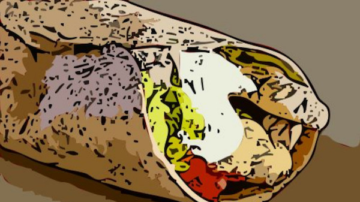

# tortilla



`tortilla` is a python library for wrapping up all the nuts and bolts of image
classification using Deep Convolutional Neural Networks in a single package.

Powered by [PyTorch](http://pytorch.org/),
It has deep integrations with [visdom](https://github.com/facebookresearch/visdom)
which helps us have powerful visualisations to monitor the training, and also publish ready plots for training, evaluation and predictions.

As always, contributions welcome. :D

**NOTE** This is a work in progress :construction:, and will take a few more weeks before it is production ready.

# Installation
* Install Anaconda3 from [https://www.anaconda.com/download/](https://www.anaconda.com/download/)
* Create your conda env and activate it :
```
  conda create python=3.5 --name tortilla
  source activate tortilla
```
* Install pytorch using :
```
  conda install pytorch torchvision -c pytorch #python3.5 + cuda8
  # or
  conda install pytorch torchvision cuda90 -c pytorch #python3.5 + cuda9.0
  # or
  conda install pytorch torchvision cuda91 -c pytorch #python3.5 + cuda9.1
  # or the safest
  conda install pytorch-cpu torchvision -c pytorch #python3.5 and cpu version of pytorch

  # More instructions for pytorch installation at : http://pytorch.org/
```
* Clone and install tortilla :
```
  git clone https://github.com/spMohanty/tortilla
  cd tortilla
  pip install -r requirements.txt
```
# Usage
## Prepare Data

For the task of image classification, [Tortilla](https://github.com/spMohanty/tortilla) expects the data to
be arranged in folders and subfolders. Create one root folder, and inside this root folder include one folder
each for every `class` in your classification problem.
The structure should look something like :
```
/-root_folder
----/class-1
----/class-2
----/class-3
----/class-4
....
...
and so on
```

Now, lets the the root folder is present at `<root_folder_path>`. We will need to resize all the images, divide them into
train-test splits, etc.

This can be done by :

```
python scripts/data-prepartion/prepare_data.py --input-folder-path <CHANGE_ME_root_folder_path> --output-folder-path datasets/CHANGE_ME_my_dataset_name --dataset-name=CHANGE_ME_my_dataset_name
```

The total list of options available with the data preparation script are :
```
usage: prepare_data.py [-h] --input-folder-path INPUT_FOLDER_PATH
                       --output-folder-path OUTPUT_FOLDER_PATH
                       [--min-images-per-class MIN_IMAGES_PER_CLASS]
                       [--train-percent TRAIN_PERCENT] --dataset-name
                       DATASET_NAME [--img-size IMG_SIZE]

Converts dataset from folder-subfolder format (one sub folder per class) to
tortilla's data format

optional arguments:
  -h, --help            show this help message and exit
  --input-folder-path INPUT_FOLDER_PATH
                        Path to input folder containing images (default: None)
  --output-folder-path OUTPUT_FOLDER_PATH
                        Path to output folder to write images (default: None)
  --min-images-per-class MIN_IMAGES_PER_CLASS
                        Minimum number of images required per class (default:
                        500)
  --train-percent TRAIN_PERCENT
                        Percentage of all images to use as training data
                        (default: 0.8)
  --dataset-name DATASET_NAME
                        Name of the Dataset (default: None)
  --img-size IMG_SIZE   Size of the target images (default: 256x256)
```

If the previous script executed without any errors, then you should have a new datasets folder at `datasets/CHANGE_ME_my_dataset_name`
which should have resized versions of all the images, and also split into training and validation sets.

## Training

Training will be done by the `tortilla-train.py` script, and a list of all the available options is as follows :

```
==============================================================================================================================
         tttt                                                        tttt            iiii  lllllll lllllll
      ttt:::t                                                     ttt:::t           i::::i l:::::l l:::::l
      t:::::t                                                     t:::::t            iiii  l:::::l l:::::l
      t:::::t                                                     t:::::t                  l:::::l l:::::l
ttttttt:::::ttttttt       ooooooooooo   rrrrr   rrrrrrrrr   ttttttt:::::ttttttt    iiiiiii  l::::l  l::::l   aaaaaaaaaaaaa
t:::::::::::::::::t     oo:::::::::::oo r::::rrr:::::::::r  t:::::::::::::::::t    i:::::i  l::::l  l::::l   a::::::::::::a
t:::::::::::::::::t    o:::::::::::::::or:::::::::::::::::r t:::::::::::::::::t     i::::i  l::::l  l::::l   aaaaaaaaa:::::a
tttttt:::::::tttttt    o:::::ooooo:::::orr::::::rrrrr::::::rtttttt:::::::tttttt     i::::i  l::::l  l::::l            a::::a
      t:::::t          o::::o     o::::o r:::::r     r:::::r      t:::::t           i::::i  l::::l  l::::l     aaaaaaa:::::a
      t:::::t          o::::o     o::::o r:::::r     rrrrrrr      t:::::t           i::::i  l::::l  l::::l   aa::::::::::::a
      t:::::t          o::::o     o::::o r:::::r                  t:::::t           i::::i  l::::l  l::::l  a::::aaaa::::::a
      t:::::t    tttttto::::o     o::::o r:::::r                  t:::::t    tttttt i::::i  l::::l  l::::l a::::a    a:::::a
      t::::::tttt:::::to:::::ooooo:::::o r:::::r                  t::::::tttt:::::ti::::::il::::::ll::::::la::::a    a:::::a
      tt::::::::::::::to:::::::::::::::o r:::::r                  tt::::::::::::::ti::::::il::::::ll::::::la:::::aaaa::::::a
        tt:::::::::::tt oo:::::::::::oo  r:::::r                    tt:::::::::::tti::::::il::::::ll::::::l a::::::::::aa:::a
          ttttttttttt     ooooooooooo    rrrrrrr                      ttttttttttt  iiiiiiiillllllllllllllll  aaaaaaaaaa  aaaa
==============================================================================================================================

usage: tortilla-train.py [-h] --experiment-name EXPERIMENT_NAME
                         [--experiments-dir EXPERIMENTS_DIR] --dataset-dir
                         DATASET_DIR [--model MODEL] [--optimizer OPTIMIZER]
                         [--batch-size BATCH_SIZE] [--epochs EPOCHS]
                         [--learning-rate LEARNING_RATE] [--top-k TOP_K]
                         [--num-cpu-workers NUM_CPU_WORKERS]
                         [--visdom-server VISDOM_SERVER]
                         [--visdom-port VISDOM_PORT] [--no-plots] [--use-cpu]
                         [--debug] [--version]

optional arguments:
  -h, --help            show this help message and exit
  --experiment-name EXPERIMENT_NAME
                        A unique name for the current experiment (default:
                        None)
  --experiments-dir EXPERIMENTS_DIR
                        Directory where results of all experiments will be
                        stored. (default: test-food-101)
  --dataset-dir DATASET_DIR
                        Dataset directory in the TortillaDataset format
                        (default: None)
  --model MODEL         Type of the pretrained network to train with. Options
                        : ['alexnet', 'densenet121', 'densenet161',
                        'densenet169', 'densenet201', 'inception_v3',
                        'resnet101', 'resnet152', 'resnet18', 'resnet34',
                        'resnet50', 'vgg11', 'vgg11_bn', 'vgg13', 'vgg13_bn',
                        'vgg16', 'vgg16_bn', 'vgg19', 'vgg19_bn'] (default:
                        resnet-50)
  --optimizer OPTIMIZER
                        Type of the pretrained network to train with. Options
                        : ["adam"] (default: adam)
  --batch-size BATCH_SIZE
                        Batch Size. (default: 128)
  --epochs EPOCHS       Number of epochs. (default: 100)
  --learning-rate LEARNING_RATE
                        Learning Rate. (default: 0.001)
  --top-k TOP_K         List of values to compute top-k accuracies during
                        train and val. (default: 1,2,3,4,5,6,7,8,9,10)
  --num-cpu-workers NUM_CPU_WORKERS
                        Number of CPU workers to be used by data loaders.
                        (default: 4)
  --visdom-server VISDOM_SERVER
                        Visdom server hostname. (default: localhost)
  --visdom-port VISDOM_PORT
                        Visdom server port. (default: 8097)
  --no-plots            Disable plotting on the visdom server (default: False)
  --use-cpu             Boolean Flag to forcibly use CPU (on servers which
                        have GPUs. If you do not have a GPU, tortilla will
                        automatically use just CPU) (default: False)
  --debug               Run tortilla in debug mode (default: False)
  --version             show program's version number and exit
```

But before we can start the training, we need to start the `visdom` server, which will help
us visualize the actual training details. This can be done by :
```
# Please do this in a separate terminal tab
conda activate tortilla
python -m visdom.server
```
This should start a local visdom server with which the actual training code can interact.

Now we can start training by :

```
python tortilla-train.py --experiment-name CHANGE_ME_my_dataset_name --dataset-dir datasets/CHANGE_ME_my_dataset_name
```
In a bit, after you code starts running, you should be able to see all the plots, etc at
`http://localhost:8097`
(If you didnot change the `visdom-server` and `visdom-port` using the corresponding cli flags)

# Author
Sharada Mohanty (sharada.mohanty@epfl.ch)
